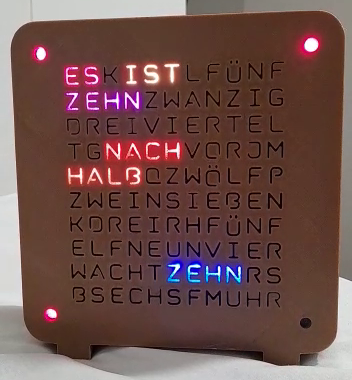

# LetiClock
German word clock implementation with some custom features. Maybe built for someone I like very much and maybe this 
explains the weird project name, maybe.

A demo of the full functionality (including OTA update) can be found 
[here on OneDrive](https://1drv.ms/v/s!ApTlIRJaAWv_hIA3SK2NMBU7i5G7rw?e=YNfXNx)

## Features
### Adaptive brightness with LDR
I put a LDR into the back side of the case and a voltage divider to read the environments' brightness.
Then an exponential function is used to account for the non-linearity of the sensor. The values were just the result of 
some experimentation.

### NTP sync
Time is synced with a given NTP server using the native time library.

### HTTP OTA Updates (incl simple PHP update server script and Dockerfile)
As the device is deployed in the field, I don't have physical access to it.
To still be able to push new features and fix bugs, it connects every few minutes to a predefined endpoint to check 
if a new firmware version is available.

The connection is encrypted over HTTPs, the certificate is self-signed and the fingerprint is part of the software 
configuration. The encryption was mainly done to encrypt MQTT traffic, and it would be pointless to maintain two 
WiFiClients.

The firmware server is a simple PHP script deployed in a docker container behind [Nginx Proxy Manager](https://nginxproxymanager.com/)
which handles the encryption. A small Python script is used to parse the version out of the C++ files and modify the python script.
Run configurations in IntelliJ (see .idea directory) are used to build the firmware, execute the Python script, build a container and deploy it
to my docker host. And yes, this can be massively improved, but it's more than sufficient for my needs.

### MQTT client for receiving scrolling text messages
C'mon on, that's fckin cool :D

Reasons for choosing MQTT were that 
- I already have a server that I maintain for my smart home devices 
- I didn't want to modify some firewalls in the place where it might be installed
- I wanted a way to send messages from whatever device

Implementation wise the interesting part is how messages are reliably delivered.
The secret there are the [QoS levels](https://www.hivemq.com/blog/mqtt-essentials-part-6-mqtt-quality-of-service-levels/)
of MQTT. 
The following requirements were set:
- A message should arrive even when network connection of the clock is bad
- A message should play until a user interaction
- A messages should not get lost because of a busy resource

I wanted to offload as much as I can to the broker. QoS level 1 helps a lot there,
as it guarantees a message to be delivered 'at least once'. So once my client first connects with QoS 1 and subscribes to a topic,
the broker will cache messages if the client goes offline / loses its connection.

And this can be used for queueing, too. Instead of keeping messages in memory, we query them one by one from the broker.
Once a message is received, the client disconnects from the broker and plays the
message until the user presses one of the two button on the backside. Further messages send during this time will be chaced
by the broker. Once the button was pressed, the clock goes back to normal mode, connects to the broker again and possibly receives the next message.
This goes on until all messages are processed.

### 3d print
As I could get my hands neither on 90 LED/m nor a 96 LED/m WS2812b, I went with a [100 LED/m WS2812 ECO](https://www.amazon.de/gp/product/B088JZCBDR) 
and scaled down the 90 LED/m 3D files X and Y axis to 90% in Cura. This worked out absolutely fine!

### Push button WiFi configuration
I figured out that WiFiManager opens the config portal in case it cannot connect to the last stored WiFi within a 
defined period of time. This is for the clocks use case unfortunate cause it's not often changing WiFi but used with 
flasky connections. So in the beginning it switched very often automatically to config mode.

To fix this, the config AP is activated by pressing both button on the back simultaneously. Otherwise, it will just indefinitely
try to connect to the last saved WiFi AP. This works perfect in the desired environment.

# Props
## Idea
- [3D Design | ingrimsch | WordClock 12h](https://www.thingiverse.com/thing:2130830)
- [Initial idea for the SW | mirohero | german word clock](https://github.com/mirohero/german-word-clock)
## Libraries
- [Scrolling Text lib | Aaron Liddiment | LEDMatrix / LEDText](https://github.com/AaronLiddiment)
- [FastLED | FastLED](https://github.com/FastLED/FastLED)
- [tzapu | WiFiManager](https://github.com/tzapu/WiFiManager)
- [knolleary | PubSubClient](https://github.com/knolleary/pubsubclient)